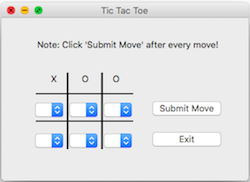
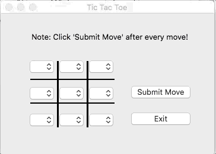

<!--
***Thank you for checking out my project. I am open to any suggestions for improvement.
***Please fork the repository and create a pull request or open an issue with the
***tag "improvement".
-->

# Tic Tac Toe Game

<br />
<p align="center">
  <a href="https://github.com/reoyamanaka/tictactoe.git">
    
  </a>

  <h3 align="center">Tic Tac Toe</h3>

  <p align="center">
    A Tic Tac Toe game ready to be exported as a stand-alone app.
    <br />
    <a href="https://github.com/reoyamanaka/tictactoe.git"><strong>Explore the docs »</strong></a>
    <br />
    <br />
    <a href="https://youtu.be/S9eU6z1p75o">View Demo</a>
    .
    <a href="https://github.com/reoyamanaka/tictactoe/issues">Report Bug</a>
  </p>
</p>

<!-- Table of Contents -->

* [About the Project](#about-the-project)
  * [Built with](#built-with)
* [Getting Started](#getting-started)
  * [Prerequisites](#prerequisites)
  * [Installation](#installation)
* [Usage](#usage)
* [Contributing](#contributing)
* [License](#license)


## About The Project

      

### Built With

* Python 3.8.1
* IDLE 3.8.1
* macOS High Sierra Version 10.13.6

## Getting Started

To get a local copy up and running follow these simple steps.

### Prerequisites

* wxPython
```sh
pip install wxpython
```

* pandas
```sh
pip install pandas
```

### Installation

1. Clone the repository
```sh
git clone https://github.com/reoyamanaka/tictactoe.git
```
2. Install wxPython module
```sh
pip install wxpython
```
3. Install pandas module
```sh
pip install pandas
```

## Usage



## Contributing

I would greatly appreciate any contributions.

1. Fork the Project
2. Create your Feature Branch (`git checkout -b feature/CoolFeature`)
3. Commit your Changes (`git commit -m 'Added some CoolFeature'`)
4. Push to the Branch (`git push origin feature/CoolFeature`)
5. Open a Pull Request


## License

Distributed under the GNU Affero General Public License v3.0 License. See `LICENSE` for more information.


## Contact

Reo Yamanaka - [LinkedIn](https://www.linkedin.com/in/reo-yamanaka-7a2289119/) - [My YouTube channel](https://www.youtube.com/channel/UCBwqp_MEM2XcSnq7kRvOB3A) - ryamanaka807@gmail.com

Project Link: [https://github.com/ryamanaka/tictactoe](https://github.com/ryamanaka/tictactoe)
